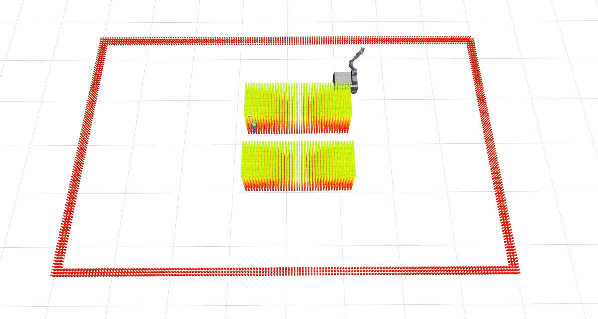

# Mobile Manipulator Charging Demo

This repository contains a REMANI-Planner based mobile-manipulator demo for a
charging-port reaching task. The scene has two car-like cuboid obstacles with a
narrow gap between them. The planner drives the mobile base and arm so that the
end-effector reaches the charger target.

The code is based on the original REMANI-Planner project. 

## Original vs Modified REMANI

The following examples compare the original REMANI behavior with the modified
charging-demo planner. `org1` and `org2` are original REMANI runs. `dev1` and
`dev2` are modified-version runs using the MOMA/Piper mobile manipulator model
and the charging-scene planner changes.

| Original REMANI | Modified version |
| --- | --- |
| **org1**  | **dev1**  |
| **org2**  | **dev2**  |

# Original REMANI-Planner

This demo is built on top of the original REMANI-Planner:

- Project: https://github.com/SYSU-STAR/REMANI-Planner
- Paper: https://ieeexplore.ieee.org/document/10610192

Please refer to the original project for the full method description, citation,
license, and upstream usage instructions.
