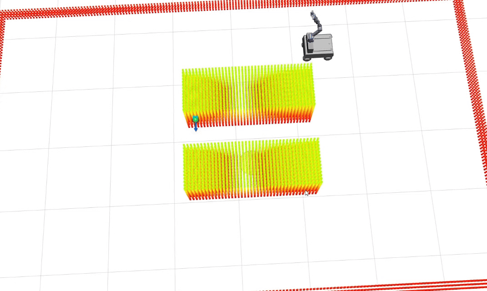
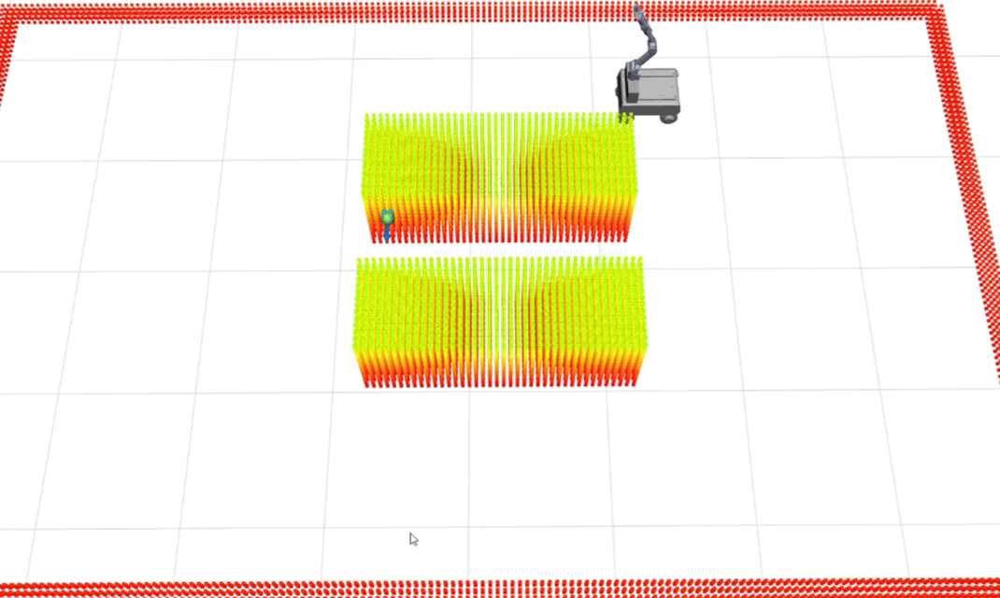
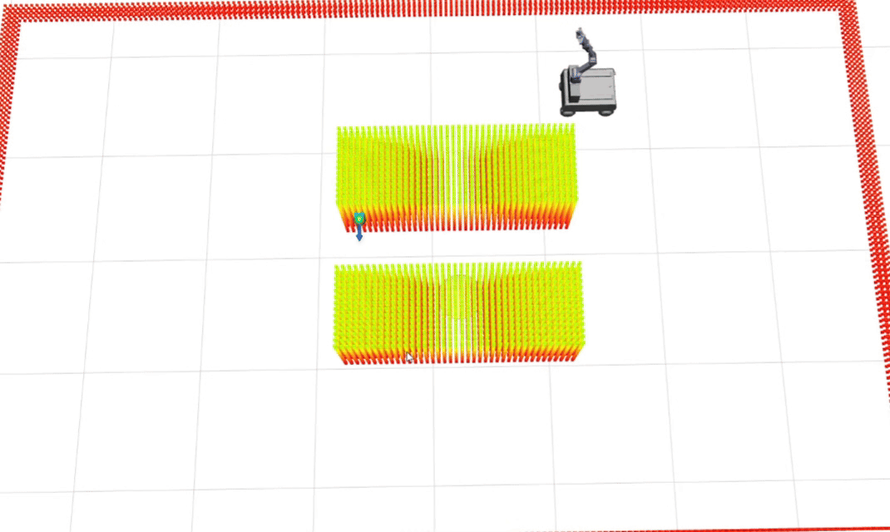

# Mobile Manipulator Charging Demo

This repository builds a mobile-manipulator charging demo on top of the
original REMANI-Planner. The robot must drive through a two-vehicle charging
scene and reach a charging port with its end-effector. The current codebase is
used to compare three planner settings:

- `v5.28`: the previous charging-demo method from the `main` branch.
- `v6.1`: the latest charging-demo method.
- `remani`: the original REMANI-style baseline with charging-specific target
  selection and staging disabled.

## Build

```bash
cd ~/remani_ws/remani_mpd_ws
catkin_make
source devel/setup.bash
```

## RViz Commands

The following commands replay `random_07_r0`, with initial pose
`(x=1.423, y=1.470, yaw=-180)` and `random_seed=2`.

### v5.28

```bash
cd ~/remani_ws/remani_main_ws
source devel/setup.bash

roslaunch remani_planner exp_charging.launch \
  init_x:=1.423 init_y:=1.470 init_yaw:=-180 \
  show_rviz:=true \
  flexible_goal_enabled:=true \
  ik_goal_enabled:=true \
  base_only_frontend_enabled:=true \
  arm_activation_enabled:=true \
  arm_activation_collision_skip_weight:=1.10 \
  random_seed:=2
```

### v6.1

```bash
cd ~/remani_ws/remani_mpd_ws
source devel/setup.bash

roslaunch remani_planner exp_charging.launch \
  init_x:=1.423 init_y:=1.470 init_yaw:=-180 \
  show_rviz:=true \
  flexible_goal_enabled:=true \
  ik_goal_enabled:=true \
  base_only_frontend_enabled:=true \
  arm_activation_enabled:=true \
  arm_activation_collision_skip_weight:=1.10 \
  max_seach_time:=0.5 \
  random_seed:=2
```

### remani

```bash
cd ~/remani_ws/remani_mpd_ws
source devel/setup.bash

roslaunch remani_planner exp_charging.launch \
  init_x:=1.423 init_y:=1.470 init_yaw:=-180 \
  show_rviz:=true \
  flexible_goal_enabled:=false \
  ik_goal_enabled:=false \
  min_approach_standoff:=-999.0 \
  base_only_frontend_enabled:=false \
  arm_activation_enabled:=false \
  manipulator_safe_collision_check:=false \
  arm_activation_collision_skip_weight:=0.85 \
  max_seach_time:=0.5 \
  random_seed:=2
```

## RViz GIFs

Replace these GIFs after recording the updated RViz videos.

| v5.28 | v6.1 | remani |
| --- | --- | --- |
|  |  |  |

## random_07_r0 Summary

| Method | Success | EE err (m) | Min clearance (m) | Base path (m) | Yaw var (rad) | Replans | First traj (s) | Plan sum (ms) | Opt fails | IK goal |
| --- | --- | ---: | ---: | ---: | ---: | ---: | ---: | ---: | ---: | --- |
| v5.28 | yes | 0.016 | 0.064 | 3.565 | 3.587 | 12 | 13.418 | 197.389 | 12 | yes |
| v6.1 | yes | 0.016 | 0.063 | 3.593 | 3.631 | 17 | 14.440 | 281.329 | 17 | yes |
| remani | yes | 0.006 | 0.071 | 3.573 | 3.422 | 15 | 15.836 | 153.147 | 15 | no |

## Current v6.1 Limitations

Result-level issues:

- On `random_07_r0`, `v6.1` still needs 17 replans, which is higher than
  `v5.28` and `remani`.
- The first received trajectory is slower than `v5.28` on this case
  (`14.440 s` vs. `13.418 s`).
- The minimum clearance is not improved over the other two settings on this
  case.
- The end-effector error is similar to `v5.28`, but larger than `remani` for
  this specific case.

Method-level issues:

- `v6.1` still relies on heuristic IK docking-goal selection and base-only
  frontend staging. These choices can improve feasibility, but they do not yet
  optimize replan count, trajectory latency, or motion smoothness directly.
- The transition from base-dominant planning to whole-body behavior is not a
  continuous adaptive-dimensional formulation. It is still closer to an
  engineering staging mechanism.
- Candidate goal selection does not yet predict downstream whole-body
  optimization difficulty, so some candidates can be reachable but still cause
  repeated replanning.
- A more principled version should treat arm participation as a continuous,
  context-dependent planning variable instead of a mostly discrete
  base-only/whole-body decision.


# Original REMANI-Planner

This demo is built on top of the original REMANI-Planner:

- Project: https://github.com/SYSU-STAR/REMANI-Planner
- Paper: https://ieeexplore.ieee.org/document/10610192

Please refer to the original project for the full method description, citation,
license, and upstream usage instructions.
